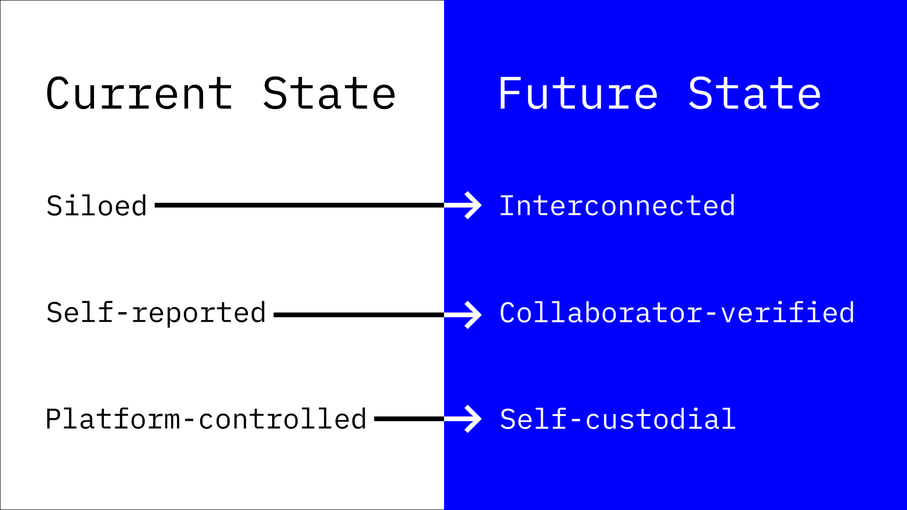

---
layout:
  title:
    visible: true
  description:
    visible: true
  tableOfContents:
    visible: true
  outline:
    visible: false
  pagination:
    visible: true
---

# About OTTP

**What Is OTTP?**

Open to the Public (OTTP) is an open protocol for co-creating, attesting to, and owning your collaboration graph. Think of it as a public space where anyone can browse existing projects, contribute work, or create new initiatives—all while establishing verified records of who did what and with whom.

#### Why OTTP?

* Break Free From Platform Lock-In: Contributions aren’t trapped on specific sites (e.g., LinkedIn, GitHub).
* Recognize & Own Your Work: Credit for your efforts remains yours to carry across the ecosystem.
* Scale Open Collaboration: Anyone, from individuals to businesses, can tap into a shared dataset to build and innovate together.

<figure><figcaption></figcaption></figure>

#### Key Actions

* Browse: Discover projects, see who’s building, and find collaboration opportunities.
* Contribute: Submit work or create proposals; gain verified credit for your efforts.
* Create: Launch your own project and let others pitch in.

#### Example Use Cases

1. Open-Source Projects: Anyone can propose ideas, submit contributions, and spin off sub-projects.
2. Businesses Building Projects in Public: Teams verify their own work while inviting outside contributions they can choose to adopt.
3. Creative Collaboration: Writers, artists, and editors can co-create and give each other credit.
4. Building on Others’ Work: Cite and expand upon another person’s project, even if they haven’t joined OTTP yet.

#### How It Works

* Attestations: The core unit of proof. A simple, open standard (via EAS schemas) lets anyone verify their contributions.
* Identity & Ownership: Work is linked to recoverable, permanent identities—not just a single wallet—ensuring you truly own your record.
* Expandable & Adaptable: The protocol supports multiple use cases (see examples above), and can evolve as new clients add features.

#### Progress

* V1&#x20;
  * [Contracts ](https://github.com/opentothepublic/contracts)and [sdk](https://github.com/opentothepublic/ottp-sdk).
  * Farcaster [frames v1 to attest](https://warpcast.com/ottp/0x20ab0361) (no longer functional)
* V2
  * \[in progress] [Open Source Front-end Client](https://github.com/opentothepublic/ottp-web-client) (see [video of the design](https://www.youtube.com/watch?v=Qgb6xj09eks))
  * \[in progress] Revamped Smart Contracts and SDK
  * Farcaster frames v2

#### In a Nutshell

OTTP aspires to reclaim the web’s original spirit—free, open, and interconnected—by making contributions portable, verifiable, and accessible to all. If you’re ready to join or just curious about how it works, jump in; the next great collaboration could be yours to start.

\

