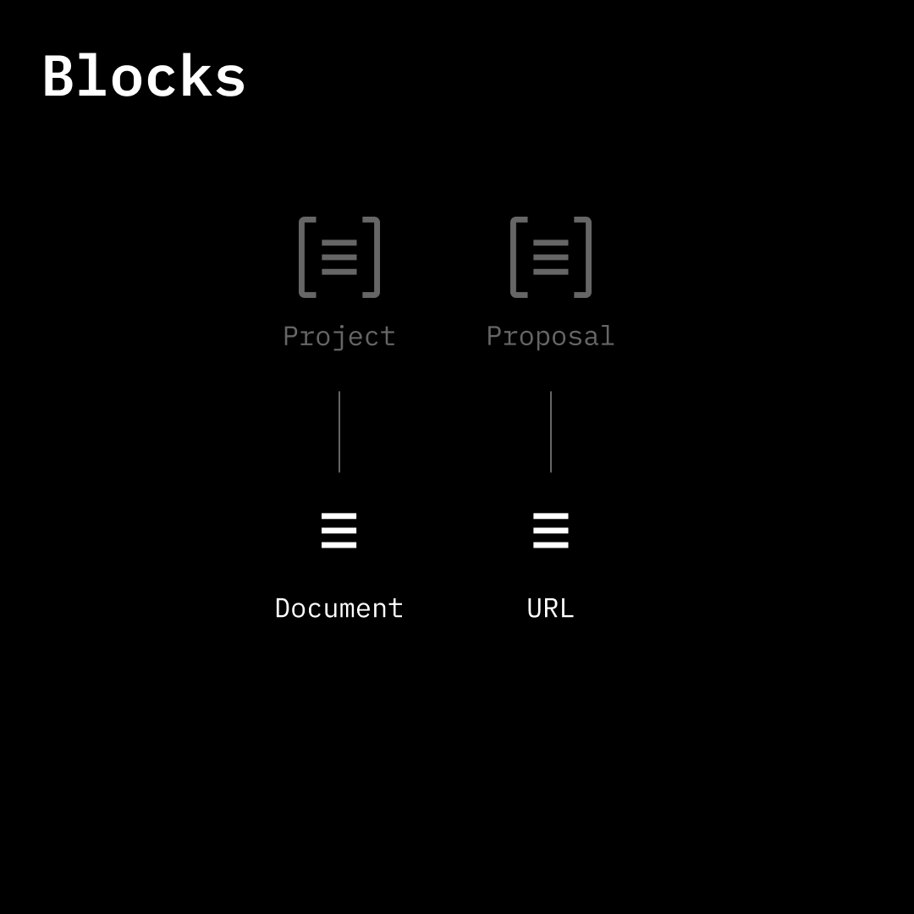

# Blocks

<figure><figcaption></figcaption></figure>

Blocks are subcomponents of objects (project, proposal, milestone, and contribution) created by subjects (individuals or teams) via onchain attestations.

Blocks can point to onchain or offchain data (files, images, URLs, etc.). The offchain URI can be updated.

Onchain data:

* Block creator
* Block reference ID
* Timestamp
* Object reference ID

Data in offchain URI can include, but is not limited to, object names, descriptions, URLs, and images.

#### Block

* Create a Block
* Fetch Blocks
* Update a Block
* Revoke a Block
