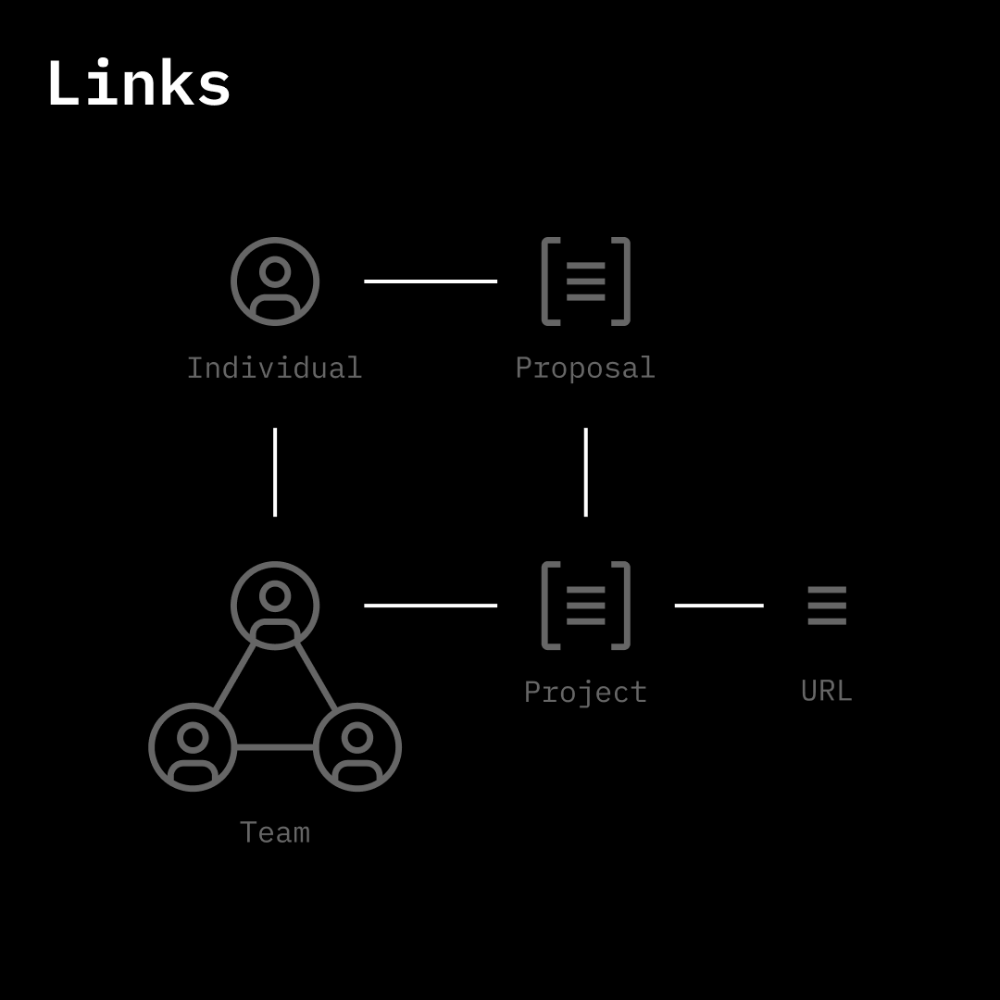

# Links

<figure><figcaption></figcaption></figure>

Links are verified connections between [subjects](subjects.md), [objects](objects.md), or [blocks](blocks.md).\
\
Every link can be verified by other subjects via onchain attestations, confirming or strengthening the connection. It can also be updated or revoked.

Direct Links:

* subject to subject
* subject to object
* object to object
* object to block

#### Link

* Create a Link
* Fetch Links
* Update a Link
* Revoke a Link
