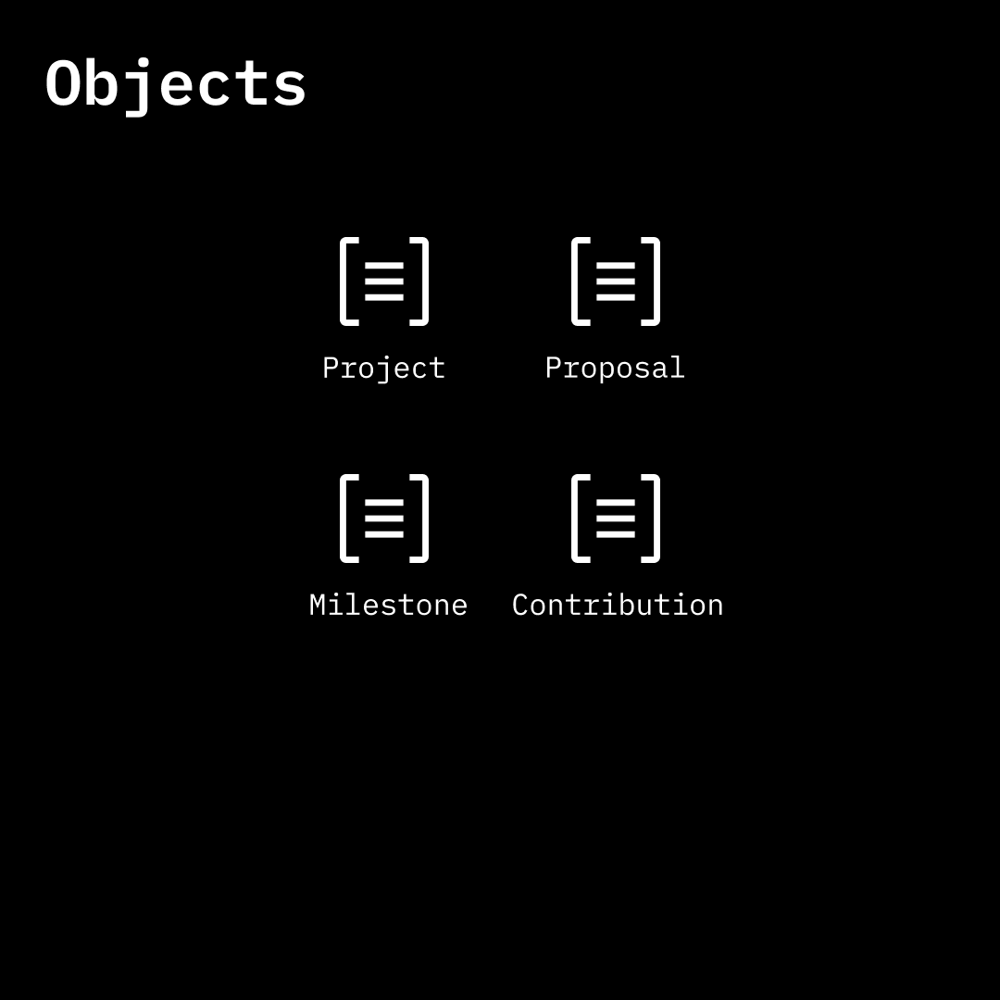

# Objects

<figure><figcaption></figcaption></figure>

Objects are containers for blocks. There are four object types: project, proposal, milestone, and contribution. Any subject (individual or team) can create an object via an onchain attestation and link it to other objects and/or subjects.

Onchain data:

* Object creator
* Object type
* Object reference ID
* Timestamp
* Block(s)

#### Object

* Create an Object
* Fetch Objects
* Update an Object(?)
* Revoke an Object
