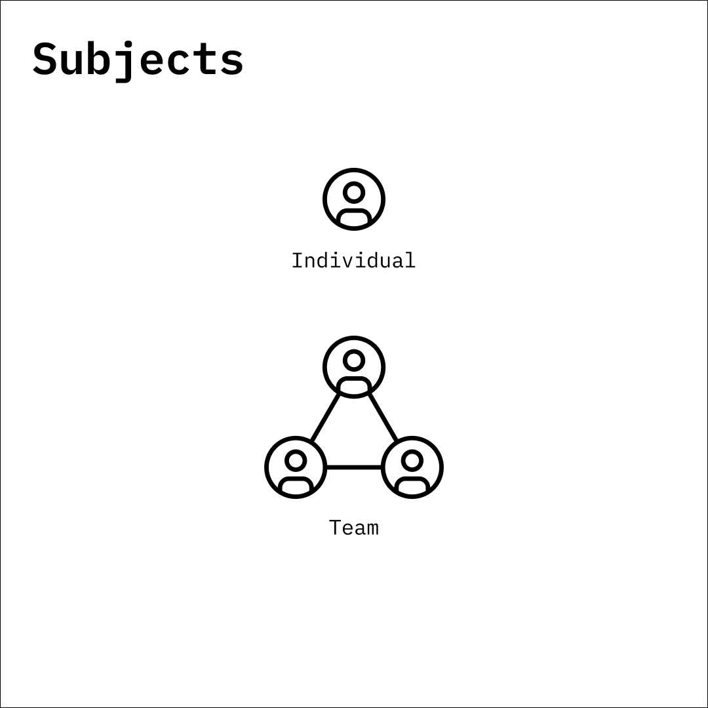

# Subjects

<figure><figcaption></figcaption></figure>

Subjects—individual or team—are identities who take actions. An individual can create a team, which is composed of individuals who act on behalf of the team. Subjects can also create objects, blocks, or links.

A subject is created via an onchain attestation. Individuals and teams receive unique identifiers, OTTP ID and ORG ID, respectively.&#x20;

#### Individual

* Create an Account
* Fetch Accounts
* Update Account Metadata
* Delete Accounts

#### Team

* Create an Account
* Fetch Accounts
* Update Account Metadata
* Account Managers
* Delete Accounts

\
