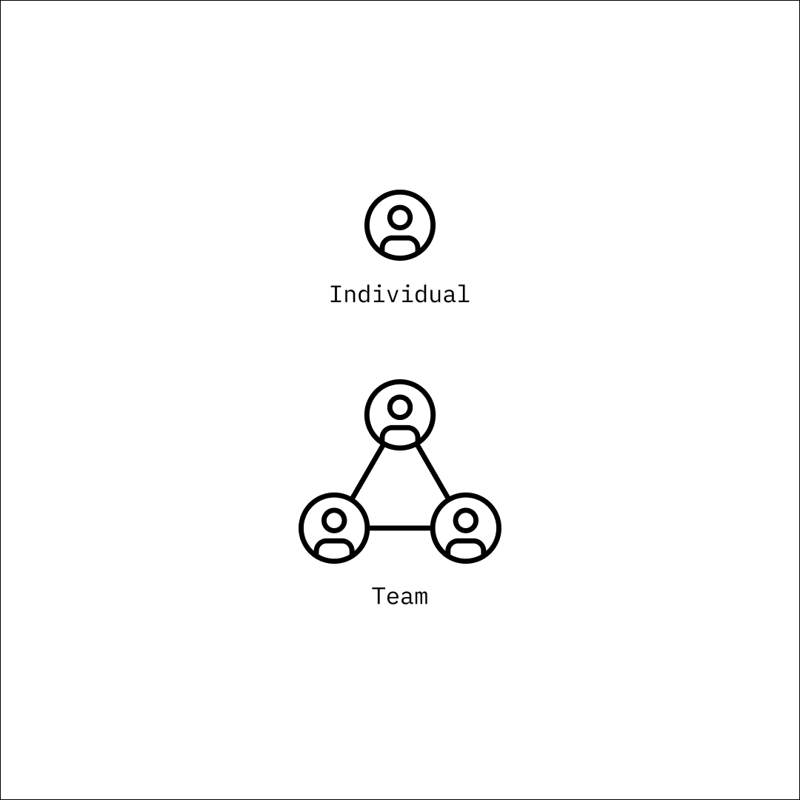

# Accounts

#### Account Creation

Accounts are currently created by making an attestation with an Ethereum wallet on Base.

Upon account creation, every user is assigned an **OTTP ID**. This is permanent and never changes.

#### Updatable Info

After account creation, these aspects of your account will be able to be updated.

* Your **username**&#x20;
* Visible **wallet**
* **Connected accounts** (Farcaster, Lens)
* **Login** methods (Farcaster, hot wallet, email)
* **Recovery** methods
* Profile description and picture

#### Individual Accounts -> Teams

Individual accounts can form teams, so that a group of people can act or attest as a team, instead of as individuals. This allows certain accounts to have permission to act on behalf of the team, allowing for the flexibility of changing out team members while maintaining the history of attestations tied to the same team name.

<figure><figcaption></figcaption></figure>

\
