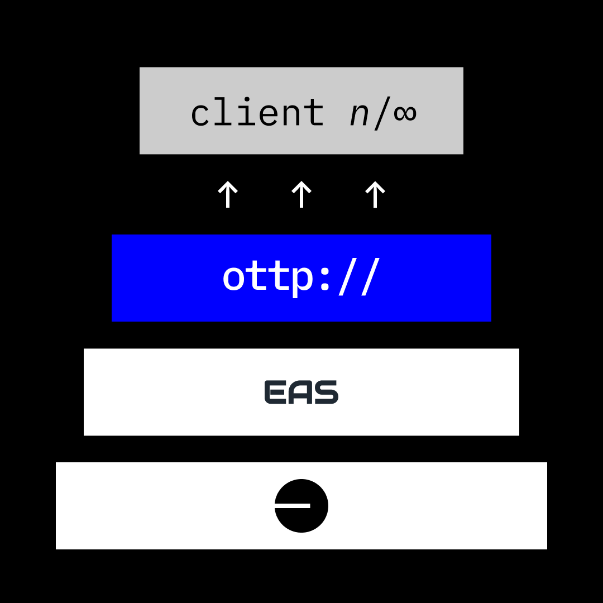

# Apps

#### One Protocol, Many Clients

OTTP is built on EAS, a general purpose attestation layer, which anyone can use to attest about anything. Similarly, anyone can build on OTTP, a general purpose collaboration layer, to create applications for collaboration.

<figure><figcaption></figcaption></figure>

#### Custom Applications for Different Purposes

This enables clients built for different purposes to talk to each other through a shared OTTP collaboration layer. For example, a crowdfunding application could help fund ventures, while the ventures could coordinate their work through another application, and freelancers could look for work opportunities for these ventures through their own tailored application. Each of these applications (funding, work coordination, hiring freelancers) can all access and write to the same underlying collaboration data.

It’s like web2 platforms having open APIs which can never be closed.

In this example, a Gitcoin and Optimism grant page could both reference the same underlying project data, with associated onchain collaboration records and social accounts:

<figure><figcaption></figcaption></figure>

\
