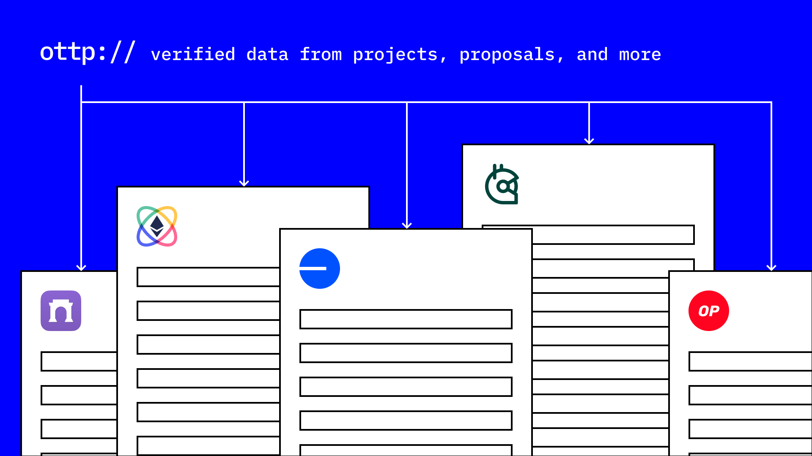

# Projects, Proposals, Milestones, and Contributions

<figure><figcaption></figcaption></figure>

An individual or team can create projects, proposals, milestones, or contributions that link to each other and/or collaborators. It’s modular—linking instead of nesting—and interoperable.

Projects, proposals, milestones, or contributions contain both onchain and offchain data.

Each link is a verified connection made by an individual or team. It can be updated or revoked.

\
